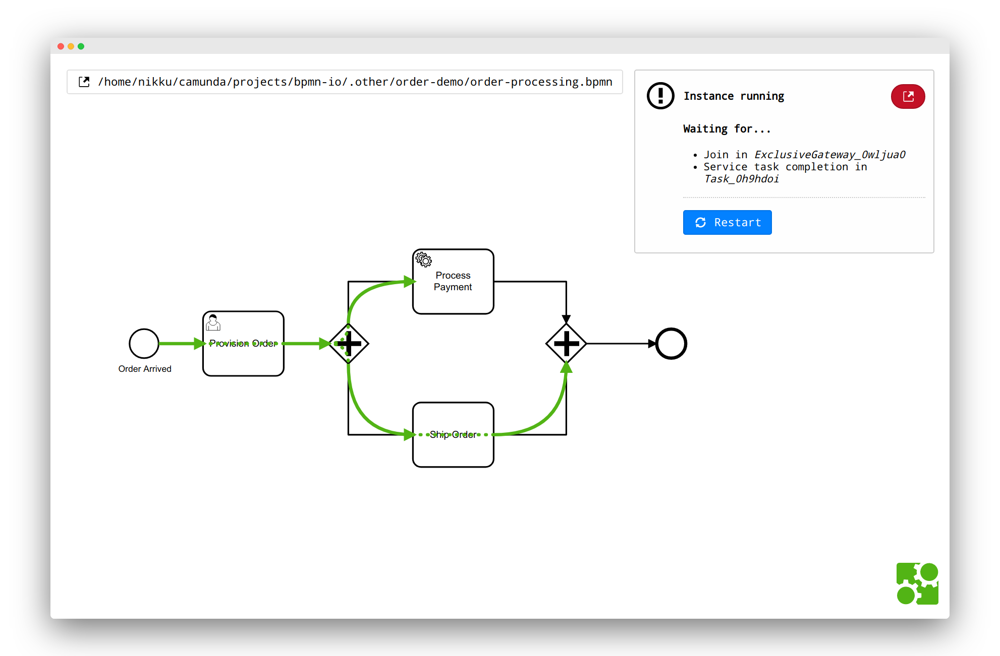

# order-demo

Showcasing the [camunda-playground](https://github.com/nikku/camunda-playground) in action.

## Steps

* Show `order-processing.bpmn`
* Spawn in [camunda-playground](https://github.com/nikku/camunda-playground)
* Make _Process Payment_ a service task
* Make service task an external task worker
* Spawn node worker: `cd payment-processor && node worker.js`
* See stuff completes
* Make _Provision Order_ a user task
* Go to tasklist via link to complete user task
